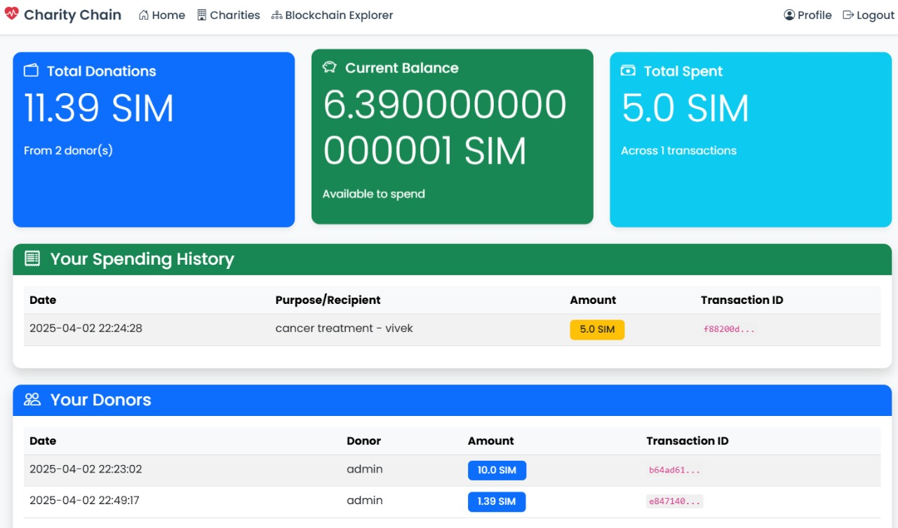
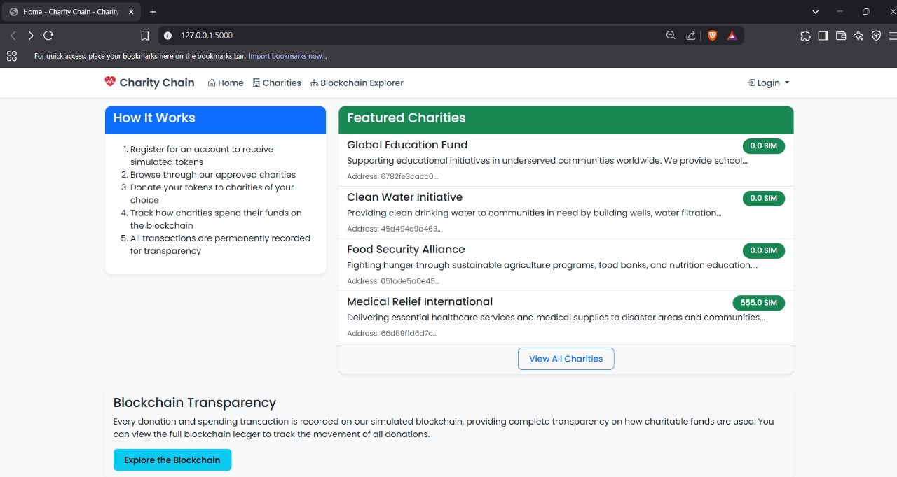
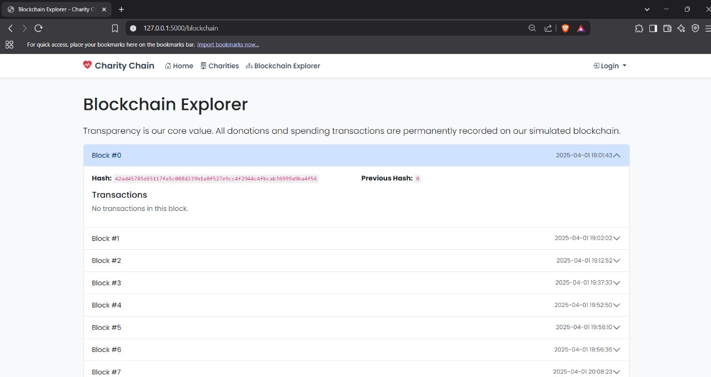
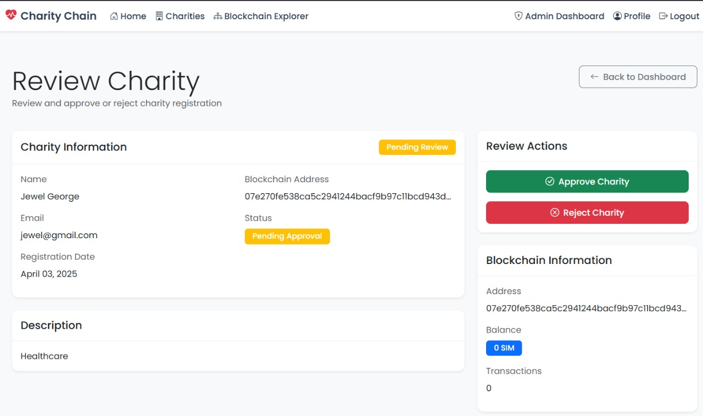

# Charity Chain

A blockchain-based platform for transparent charitable donations and spending tracking.

## Features

- User registration and authentication
- Charity registration and approval system
- Blockchain-based donation tracking
- Transparent spending records for charities
- Admin dashboard for charity management
- Real-time blockchain explorer

## Screenshots

### Charity Dashboard

*The charity dashboard showing donation stats, spending history, and donor information.*

### Blockchain Explorer

*The blockchain explorer showing all transactions recorded on the blockchain.*

### Admin Charity Review

*Admin interface for reviewing and approving charity applications.*

### Home Page

*The home page showing featured charities and how the platform works.*

### Donation Interface

*Interface for users to make donations to charities.*

## Tech Stack

- Python 3.x
- Flask
- SQLite
- Blockchain (Custom Implementation)
- Bootstrap 5
- jQuery

## Installation

1. Clone the repository:
```bash
git clone https://github.com/yourusername/charity-chain.git
cd charity-chain
```

2. Create and activate a virtual environment:
```bash
python3 -m venv venv
source venv/bin/activate  # On Windows: venv\Scripts\activate
```

3. Install dependencies:
```bash
pip install -r requirements.txt
```

4. Set up the database:
```bash
flask db upgrade
```

5. Create an admin user:
```bash
python3 setup_admin.py
```

6. Run the application:
```bash
python3 run.py
```

The application will be available at `http://localhost:5001`

## Project Structure

```
charity-chain/
├── app/
│   ├── __init__.py
│   ├── models/
│   ├── routes/
│   ├── templates/
│   ├── static/
│   └── utils/
├── instance/
├── migrations/
├── requirements.txt
├── run.py
└── setup_admin.py
```

## Contributing

1. Fork the repository
2. Create your feature branch (`git checkout -b feature/AmazingFeature`)
3. Commit your changes (`git commit -m 'Add some AmazingFeature'`)
4. Push to the branch (`git push origin feature/AmazingFeature`)
5. Open a Pull Request

## License

This project is licensed under the MIT License - see the LICENSE file for details. 
This is a simulation for educational purposes only. No real cryptocurrencies or funds are involved. 

